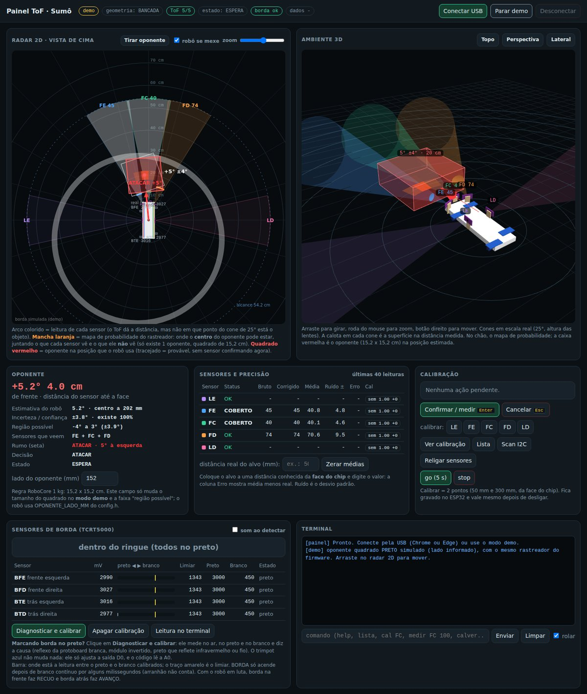
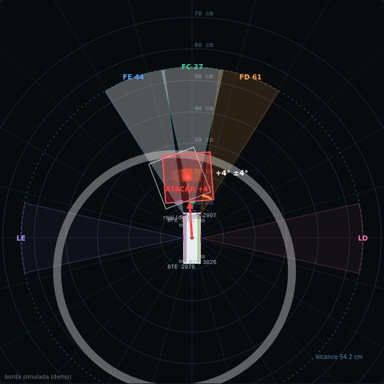
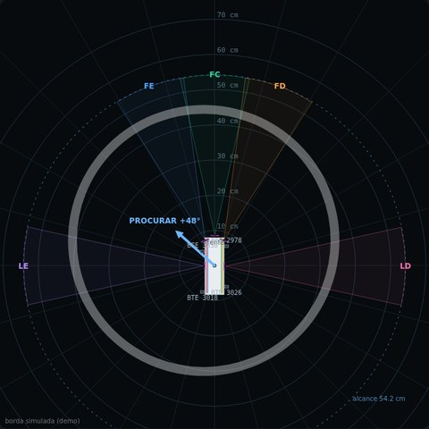
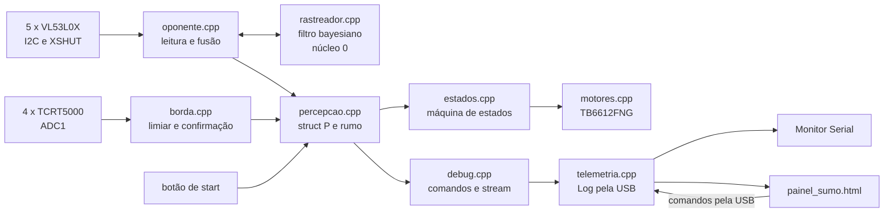
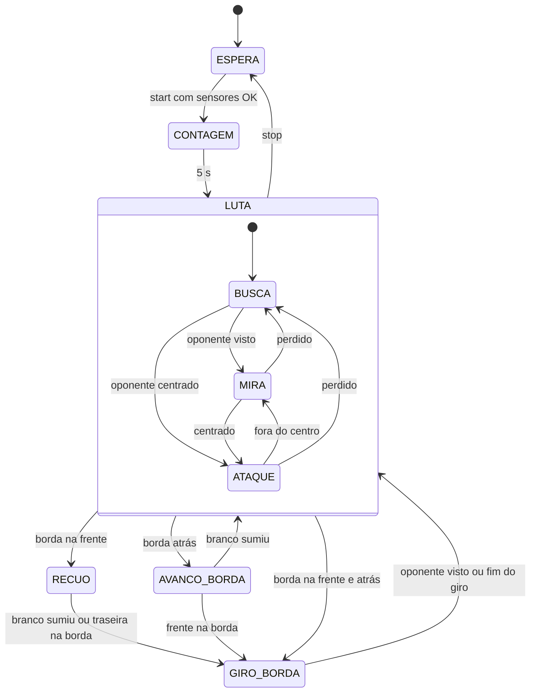

# Robô Sumô 1 kg com ESP32


[](https://github.com/felcoslop/LAB_III_Grupo_D_UFMG_2026_2/actions/workflows/compilacao.yml)

Firmware e painel de telemetria do robô sumô autônomo da classe de 1 kg do **Grupo D**, desenvolvido na disciplina ELE635 Laboratório de Sistemas III da UFMG. O ESP32 lê cinco sensores de distância VL53L0X e quatro sensores de linha TCRT5000, estima onde está o oponente com um filtro bayesiano em grade e decide o movimento com uma máquina de estados. Um painel web, que abre direto no navegador e conversa com o robô pela USB, mostra sensores, mapa de probabilidade, rumo e estado em 2D e 3D.



## Sumário

- [Contexto](#contexto)
- [Funcionalidades](#funcionalidades)
- [Hardware](#hardware)
- [Instalação](#instalação)
- [Uso](#uso)
- [Arquitetura](#arquitetura)
- [Mapa do código](#mapa-do-código)
- [Configuração](#configuração)
- [Estrutura de pastas](#estrutura-de-pastas)
- [Integração contínua](#integração-contínua)
- [Equipe](#equipe)

## Contexto

O projeto faz parte da disciplina ELE635 Laboratório de Sistemas III, do curso de Engenharia de Sistemas da UFMG, no semestre 2026/2, com o Prof. Gustavo Medeiros Freitas. A disciplina cobre o ciclo completo de um projeto de engenharia, da concepção até a competição, e o robô segue a classe de 1000 g (Lego/Vex Sumô) das regras de sumô da RoboCore [ROBOCORE, s.d.]: massa de até 1000 g, base de 15,2 x 15,2 cm, dojô (no código, dohyo) preto de 77 cm de diâmetro com borda branca de 2,5 cm, controle totalmente autônomo e início obrigatório 5 s depois do comando.

A versão atual roda em uma bancada de teste. Os sensores ficam presos em uma protoboard que faz o papel de chassi provisório, e o ESP32 fica ligado ao computador pela USB, que alimenta a placa e leva a telemetria. Nessa fase os motores ficam desligados no firmware (`USAR_MOTORES 0`), mas a máquina de estados roda normalmente e o painel mostra o comando que iria para cada roda.

## Funcionalidades

- Identificação dos cinco VL53L0X pelo pino XSHUT, com endereço I2C próprio para cada sensor e nova tentativa automática quando algum para de responder.
- Leitura escalonada e sem bloqueio dos ToF, com mediana de 3 leituras e calibração de 2 pontos gravada na memória do ESP32.
- Rastreador bayesiano em grade polar, rodando no segundo núcleo, que aproveita também a informação dos sensores que não veem nada e reconhece a arena vazia.
- Rumo (a seta do painel) até o oponente ou até os pontos cegos, usado pela máquina de estados na busca.
- Leitura analógica da linha branca, com confirmação por tempo e calibração guiada em três medidas (ar, preto e branco).
- Máquina de estados com contagem obrigatória de 5 s, busca, mira, ataque e fuga da borda.
- Painel 2D e 3D em um único arquivo HTML, sem internet, ligado ao robô pela USB, com dados a 50 Hz e comandos pelo navegador.
- Firmware sem rádio: o robô compete de forma autônoma, sem WiFi e sem Bluetooth, o que deixa o núcleo 0 livre para o rastreador.
- Terminal de comandos pela USB ou pelo painel para teste, calibração e diagnóstico.

## Hardware

| Componente | Qtd. | Uso no projeto |
|---|---|---|
| ESP32 DevKit V1 (30 pinos) com placa de expansão | 1 | microcontrolador de dois núcleos, com ADC (o rádio fica desligado) |
| VL53L0X (placas CJVL53L0XV2 / GY-530) | 5 | distância até o oponente: LE, FE, FC, FD e LD |
| TCRT5000 com comparador LM393 | 4 | linha branca da borda, lida pela saída analógica A0 |
| TB6612FNG | 1 | ponte H dos dois motores (desativada na bancada) |
| Botão | 1 | start, ligado entre o GPIO 32 e o GND |

| Função | GPIO | Observação |
|---|---|---|
| I2C SDA / SCL | 21 / 22 | barramento comum dos cinco ToF, a 100 kHz |
| XSHUT LE / FE / FC / FD / LD | 13 / 14 / 27 / 26 / 25 | um fio por sensor, define o nome de cada um |
| Borda BFE / BFD (frente) | 34 / 35 | ADC1, pinos só de entrada |
| Borda BTE / BTD (trás) | 36 (VP) / 39 (VN) | ADC1, pinos só de entrada |
| Botão de start | 32 | `INPUT_PULLUP`, nível baixo indica botão apertado |
| LED de status | 2 | LED azul da placa |
| TB6612 PWMA / AIN1 / AIN2 | 18 / 19 / 23 | motor esquerdo, STBY ligado direto no 3V3 |
| TB6612 PWMB / BIN1 / BIN2 | 4 / 16 / 17 | motor direito |

Todos os sensores ficam no 3V3 do ESP32. As placas clone do VL53L0X puxam SDA e SCL para 2,8 V, nível que o ESP32 entende como 1, e o firmware nunca coloca nível alto no XSHUT: para desligar um sensor o pino vira saída em LOW e, para ligar, vira entrada com o pull-up interno. Os sensores de borda usam os pinos 34, 35, 36 e 39 do ADC1, que servem só como entrada e combinam com a saída A0 dos módulos.

Na bancada (`GEOMETRIA_BANCADA 1`), a origem do referencial é o centro da protoboard, com x para a frente e y para a esquerda, em milímetros:

| Sensor | XSHUT | Endereço | x | y | Ângulo |
|---|---|---|---|---|---|
| LE | 13 | 0x30 | -1 | 30 | 90° |
| FE | 14 | 0x31 | 73 | 27 | 20° |
| FC | 27 | 0x32 | 87 | -1 | 0° |
| FD | 26 | 0x33 | 73 | -27 | -20° |
| LD | 25 | 0x34 | -2 | -30 | -90° |

Os PDFs da pasta `doc/` trazem os gabaritos em escala 1:1 da bancada e do robô, o mapa de ligação na protoboard e uma lista de conferência antes de energizar.

## Instalação

### Requisitos

| Item | Versão | Observação |
|---|---|---|
| Arduino IDE | 1.8.x ou 2.x | |
| Core ESP32 da Espressif | 2.x ou 3.x | Gerenciador de Placas, pacote "esp32 by Espressif Systems" |
| Biblioteca VL53L0X da Pololu | 1.3.1 | Gerenciador de Bibliotecas |
| Python 3 | 3.x | necessário só para gerar o painel de novo |

O firmware usa o core do ESP32 [ESPRESSIF SYSTEMS, s.d.] e a biblioteca VL53L0X da Pololu [POLOLU, s.d.]. As bibliotecas Preferences e Wire já vêm com o core.

### Passo a passo

1. Extração do zip em uma pasta chamada `sumo_esp32`. A Arduino IDE exige que o nome da pasta seja igual ao do arquivo `.ino`, e o "Extrair tudo" do Windows usa o nome do zip, então `sumo_esp32.zip` já gera a pasta certa. Em um clone do repositório, o nome da pasta precisa do mesmo cuidado, por exemplo com `git clone https://github.com/felcoslop/LAB_III_Grupo_D_UFMG_2026_2 sumo_esp32`.
2. Abertura do `sumo_esp32.ino` na IDE. Os outros arquivos `.h` e `.cpp` aparecem como abas.
3. Ajustes no menu Ferramentas, conforme a tabela abaixo.
4. Compilação e gravação pela USB, com o botão Carregar.
5. Monitor Serial em 115200 baud, com a opção "Nova linha".

| Opção em Ferramentas | Valor |
|---|---|
| Placa | ESP32 Dev Module |
| Partition Scheme | padrão (o firmware cabe com folga) |
| Porta | porta COM do ESP32 |

## Uso

### Primeiro teste pela USB

No boot, o terminal mostra a lista de comandos e a tabela de sensores. O comando `lista` deve mostrar os cinco ToF como OK; com menos de três, o robô não inicia e o LED azul pisca rápido. O comando `scan` deve encontrar os endereços de 0x30 a 0x34, e um endereço 0x29 indica um sensor sem o fio XSHUT. No modo `id`, a mão cobrindo um sensor por vez faz o terminal escrever o nome dele, o que ajuda a conferir as etiquetas e a cor de cada fio.

### Comandos

Os comandos funcionam no Monitor Serial e no terminal do painel.

| Comando | Descrição |
|---|---|
| `help` ou `?` | lista de comandos |
| `lista` | sensores configurados, calibração e status |
| `id` | modo de identificação: o nome do sensor coberto aparece no terminal |
| `ver` | leitura contínua de sensores, oponente, borda, rumo, estado e motores |
| `scan` | endereços I2C presentes no barramento |
| `cal NOME [P1 P2]` | calibração de 2 pontos do ToF (padrão 50 e 300 mm), gravada no ESP32 |
| `calver` | ganho e offset de cada ToF |
| `calzera NOME` ou `calzera todos` | remoção da calibração gravada |
| `medir NOME MM` | conferência da calibração: média, ruído e erro com o alvo a MM milímetros |
| `borda` | leitura contínua dos sensores de borda (mV e limiar) |
| `calborda` | diagnóstico e calibração da borda em três medidas |
| `bordazera` | remoção da calibração da borda |
| `init` | nova tentativa nos ToF que falharam, com o robô parado |
| `tempo` | duração do ciclo do loop, tempo do rastreador e linhas descartadas na USB |
| `go` e `stop` | início (contagem de 5 s) e parada da máquina de estados |
| `s1` e `s0` | stream de dados para o painel, ligado e desligado |

### Painel pela USB

O arquivo `painel_sumo.html` abre direto no Chrome ou no Edge do computador, sem internet, porque o three.js está embutido nele [THREE.JS, 2022]. O botão "Conectar USB" usa a Web Serial do navegador a 115200 baud; logo depois de abrir a porta, o painel envia `s1` e passa a receber os dados a 50 Hz. O Monitor Serial da IDE precisa estar fechado, porque só um programa por vez usa a porta. O botão "Modo demo" simula um oponente preto de 15,2 cm e roda em JavaScript o mesmo rastreador do firmware; o quadrado pode ser arrastado no radar 2D e, com a opção "robô se mexe", o robô simulado obedece à seta.

| Oponente à vista (rumo ATACAR) | Arena vazia (rumo PROCURAR) |
|---|---|
|  |  |

No radar, cada cone colorido é um sensor, a mancha laranja é o mapa de probabilidade do rastreador, o quadrado vermelho é o oponente na posição estimada e a seta é o rumo entregue para a máquina de estados. O círculo cinza é a borda simulada do dojô no modo demo.

### Calibração

A distância do VL53L0X tem um erro fixo de fábrica que a biblioteca não corrige, e nas placas clone esse erro fica entre +10 e +30 mm. O comando `cal FC` pede um alvo plano e fosco a 50 mm e depois a 300 mm da face do chip; o ganho e o offset calculados ficam gravados na memória não volátil do ESP32 e continuam valendo depois de desligar. O comando `medir FC 100` confere o erro que sobrou.

Os sensores de borda passam pelo `calborda`. A medida no ar revela reflexo indesejado, como o da lateral branca da protoboard, e as medidas no preto e no branco definem a polaridade e o limiar. O limiar fica a 35% do caminho entre o branco e o preto, mais perto do branco, para arranhão e poeira não dispararem a borda [DEDE, s.d.]. Sem calibração vale o limiar fixo de 600 mV, e o `lista` avisa quando isso acontece.

### Teste da máquina de estados

O comando `go` (ou o botão de start) inicia a contagem de 5 s e depois a luta. Na bancada, com `USAR_MOTORES 0`, nenhum pino de motor muda, mas o modo `ver` e o painel mostram o estado atual e o comando de cada roda. O teste consiste em mover um objeto em volta dos sensores e acompanhar as trocas entre BUSCA, MIRA e ATAQUE. O comando `stop` volta para ESPERA.

## Arquitetura

O firmware segue uma regra simples: a máquina de estados só conhece a struct `P` (percepção). Os módulos de sensores escrevem em `P`, a estratégia lê `P` e manda nos motores, e o debug e a telemetria mostram tudo. Com essa separação, um sensor novo entra sem mexer na estratégia, e a estratégia pode ser testada com `P` preenchida à mão.



Nenhum módulo usa `delay()` dentro do loop. Cada volta chama os módulos na ordem abaixo, e cada um faz uma parte pequena do trabalho e devolve o controle.

| Ordem | Chamada | Arquivo | Papel |
|---|---|---|---|
| 1 | `percepcao_atualiza()` | percepcao.cpp | leitura dos sensores, fusão, rumo e montagem de `P` |
| 2 | `estados_passo()` | estados.cpp | decisão e comando dos motores |
| 3 | `percepcao_manutencao()` | percepcao.cpp | nova tentativa nos ToF que caíram, só em ESPERA |
| 4 | `debug_passo()` | debug.cpp | comandos e envio de dados para o painel |

O ESP32 tem dois núcleos. O loop do Arduino roda no núcleo 1, e o rastreador bayesiano, que leva alguns milissegundos por passo, roda em uma tarefa do FreeRTOS no núcleo 0. Como o firmware não liga o rádio, a pilha do WiFi não disputa esse núcleo com o rastreador. A troca de dados entre os dois acontece dentro de uma trava curta (spinlock), então o loop nunca espera o filtro terminar.

O referencial é o mesmo em todo o código: origem no centro de giro do robô, x para a frente, y para a esquerda e ângulo positivo para a esquerda. Com isso, o ângulo do oponente já é o quanto o robô precisa girar.

## Mapa do código

### `sumo_esp32.ino`

Arquivo principal. O `setup()` configura primeiro os motores, para o robô nascer parado, cria um buffer de 4 KB na serial e inicializa percepção, máquina de estados e debug. O `loop()` apenas chama os módulos na ordem da tabela de arquitetura.

### `config.h`

Este arquivo concentra tudo o que depende do hardware: pinos, posição dos sensores, limiares, velocidades e tempos. As tabelas `TOF[]` e `BORDA[]` descrevem os sensores, e o tamanho delas sai de `sizeof`, então um sensor a mais é só uma linha a mais na tabela (até 16 ToF). A chave `GEOMETRIA_BANCADA` escolhe entre as posições da bancada e as do robô. O alcance `TOF_ALCANCE_MM` vem da geometria do dojô: no pior caso, com o robô encostado em uma borda e o oponente encostado na borda oposta, a face do oponente fica a 77 cm menos 7,6 cm menos 15,2 cm, ou seja, 54,2 cm do centro do robô. Qualquer leitura mais longe é parede, mesa ou pessoa e vale como "nada".

### `percepcao.h` e `percepcao.cpp`

Estes arquivos definem a struct `P` e as partes dela: `op` (oponente), `rumo`, `borda`, `saude`, o evento `start` e o instante `t_ms`. A função `percepcao_atualiza()` mede a duração do ciclo, chama a leitura e a fusão dos ToF, calcula o rumo, lê a borda, atualiza a saúde dos sensores e trata o botão de start com debounce de 30 ms. A `percepcao_manutencao()` tenta religar os ToF que falharam a cada 2 s, somente com o robô parado, porque essa operação bloqueia por alguns milissegundos.

O rumo é a direção que o robô deve seguir agora e aparece no painel como uma seta:

| Modo | Quando | Ângulo | Cor da seta |
|---|---|---|---|
| ATACAR | oponente visto e centrado | até o oponente | vermelha |
| MIRAR | oponente visto fora do centro | até o oponente | laranja |
| PROVÁVEL | oponente perdido há pouco, mapa ainda concentrado | até onde ele provavelmente está | amarela |
| PROCURAR | sem pista | giro que leva os cones aos pontos cegos | azul |

### `oponente.h` e `oponente.cpp`

Módulo dos cinco VL53L0X, com três tarefas. A primeira é a inicialização: todos os sensores começam desligados pelo XSHUT, e cada um é ligado sozinho, responde no endereço de fábrica 0x29 e recebe o endereço da tabela. A segunda é a leitura: os sensores medem em modo contínuo a cada 20 ms e o código só consulta cada um perto da hora de ter medida nova, o que deixa o barramento I2C livre; a leitura passa pela calibração `ganho * bruto + offset`, pela mediana das 3 últimas medidas e pelo alcance de cada sensor. A terceira é a fusão: com `FUSAO_BAYES 0` as leituras do mesmo objeto viram um ponto médio, e com `FUSAO_BAYES 1` (padrão) as medidas vão para o rastreador. Um sensor só é marcado como FALHOU depois de erros repetidos de I2C, então uma pausa longa do loop não derruba um sensor bom.

### `rastreador.h` e `rastreador.cpp`

Filtro bayesiano em grade (filtro de histograma) para um único oponente quadrado de 15,2 cm [THRUN; BURGARD; FOX, 2005]. O mapa guarda a probabilidade de o centro do oponente estar em cada célula de uma grade polar de 120 direções de 3° por anéis de 20 mm, a partir de 150 mm do centro do robô. Tudo o que depende só da geometria (o que cada sensor deveria ler para cada célula) é calculado uma vez no boot, então durante a luta sobram multiplicações com tabelas, sem trigonometria. A cada medida nova o filtro passa por quatro etapas:

1. Predição: o mapa espalha um pouco, porque o oponente pode ter andado até 1,5 m/s e o robô pode ter girado; com o giro conhecido pelos motores, o mapa também gira junto.
2. Correção: cada sensor confirma as células em que a face do oponente ficaria na distância lida, e um sensor sem leitura desmente as células no meio do próprio cone (informação negativa).
3. Regra: células dentro do corpo do robô valem zero e uma pequena mistura uniforme permite reencontrar o oponente se o mapa errar.
4. Existência: uma probabilidade separada indica se existe oponente no alcance, e ela só sobe quando as leituras aparecem repetidas e coerentes. Por isso a arena vazia quase nunca gera oponente falso.

A estimativa final traz ângulo, distância, posição, incerteza (sigma), concentração do mapa, chance de existir e o giro de busca. O giro de busca sai de uma avaliação de vários giros possíveis, de 6 em 6 graus para cada lado: para cada um, o código soma quanto do mapa os cones vão varrer e divide pelo tempo de girar, e o melhor vira o rumo PROCURAR. O resultado é que o robô olha primeiro os pontos cegos onde o oponente pode estar.

### `borda.h` e `borda.cpp`

Leitura dos quatro TCRT5000 pela saída analógica, em milivolts, seguindo a recomendação de leitura analógica com limiar de tempo do Blackbook [DEDE, s.d.]. Cada sensor tem um limiar calculado a partir da calibração (ou o valor fixo do `config.h`) e um contador de leituras seguidas no branco. A borda só é confirmada com branco contínuo por pelo menos 3 ms e duas leituras, o que descarta arranhões; a linha de 2,5 cm passa em uns 25 ms com o robô a 1 m/s, então sobra margem. No final, a máscara de sensores confirmados vira as informações de lado, frente e trás usadas pela máquina de estados.

### `estados.h` e `estados.cpp`

Máquina de estados da estratégia. A borda tem prioridade sobre tudo durante a luta, e o ataque só acontece com o sensor central vendo o oponente centrado (até 7°), como recomenda o Blackbook [DEDE, s.d.]. O recuo da borda dura enquanto o sensor vê branco e mais uma folga de 10 ms, e o giro de recuperação continua vigiando o oponente.



No diagrama, LUTA agrupa BUSCA, MIRA e ATAQUE. A saída de GIRO_BORDA cai em ATAQUE, MIRA ou BUSCA, conforme o oponente esteja centrado, visto ou perdido, e a saída de AVANCO_BORDA cai em BUSCA. O comando `stop` leva qualquer estado para ESPERA.

Na BUSCA, o robô gira no eixo para o lado do rumo; depois de 1,5 s girando sem pista (rumo PROCURAR), avança por 0,25 s para mudar o ponto de vista e volta a girar. Quando o rumo é PROVÁVEL e o oponente deve estar bem à frente (até 12°), o robô avança em vez de girar. Com `MODO_DEFENSIVO 1`, o robô só gira e mira, sem avançar.

### `motores.h` e `motores.cpp`

Controle da ponte H TB6612FNG, com valores de -255 a 255 por roda. Os pinos IN1 e IN2 escolhem o sentido e o PWM define a força. As chaves `INVERTE_ESQ` e `INVERTE_DIR` corrigem um motor ligado ao contrário sem trocar fios. Com `USAR_MOTORES 0`, o módulo só guarda o último comando, que aparece no debug e entra no rastreador como estimativa do giro do robô.

### `telemetria.h` e `telemetria.cpp`

Saída de texto e entrada de comandos pela USB. O objeto `Log` substitui o `Serial` em todo o projeto: cada linha sai inteira, o que deixa o painel ler sem pedaços misturados. As linhas de dados (`D`, `Q` e `M`) são descartadas quando o buffer da serial está cheio, então o robô nunca fica esperando a USB; o comando `tempo` mostra quantas linhas foram descartadas. A função `entrada_le()` entrega ao debug os caracteres que chegam do Monitor Serial ou do painel.

### `debug.h` e `debug.cpp`

Comandos de teste e calibração, os modos contínuos (`ver`, `id`, `borda`) e o stream para o painel. Este módulo conversa com todos os outros, porque precisa mostrar tudo. Os dados para o painel seguem um protocolo de texto simples, com uma letra no início de cada linha:

| Linha | Conteúdo | Quando |
|---|---|---|
| `G`, `I`, `C` | geometria, status e calibração de cada ToF | comando `s1`, enviado pelo painel ao conectar |
| `R` | posição, limiar e calibração de cada sensor de borda | comando `s1` e depois de cada calibração |
| `B`, `E`, `K`, `X` | corpo do robô, nomes dos estados, alcance e parâmetros do rastreador | comando `s1` |
| `D` | leituras, oponente, estado, saúde, incerteza, existência e rumo | a cada 20 ms |
| `Q` | borda confirmada, borda crua e mV de cada sensor | a cada 20 ms |
| `M` | mapa de probabilidade comprimido | a cada 250 ms |

### Painel

O `painel_sumo.html` é o painel completo, com o three.js e o OrbitControls embutidos. O código fonte fica em `doc/painel_src.html`, e o script `doc/gera_painel.py` junta o fonte com as bibliotecas de `doc/vendor/` e gera o `painel_sumo.html`. Qualquer mudança no painel exige rodar `python doc/gera_painel.py` e fazer o commit dos dois arquivos; o CI confere se eles estão iguais.

### Documentos de montagem

A pasta `doc/` traz o `gabarito_bancada.pdf` (bancada em escala 1:1, vista lateral, cotas e montagem dos sensores de borda) e o `guia_montagem_sensores.pdf` (gabarito do robô, mapa de ligação na protoboard e lista de conferência). Os scripts `gera_bancada.py` e `gera_guia.py` geram esses PDFs a partir das tabelas do `config.h` com a biblioteca ReportLab; os caminhos dentro deles apontam para a pasta original de desenvolvimento e precisam de ajuste antes de rodar em outra máquina.

## Configuração

Os ajustes principais ficam no `config.h`:

| Constante | Valor | Efeito |
|---|---|---|
| `GEOMETRIA_BANCADA` | 1 | 1 usa as posições da bancada e 0 as do robô |
| `I2C_CLOCK_HZ` | 100000 | velocidade do I2C; 400000 só com fios curtos |
| `TOF_TIMING_US` | 20000 | tempo de cada medida do ToF |
| `TOF_ALCANCE_MM` | 542 (calculado) | alcance máximo a partir do centro do robô |
| `TOF_MINIMO_PARA_LUTAR` | 3 | quantidade mínima de ToF para o robô iniciar |
| `CENTRO_DEG` | 7 | ângulo máximo para o oponente contar como centrado |
| `FUSAO_BAYES` | 1 | 1 usa o rastreador e 0 a fusão simples |
| `OPONENTE_LADO_MM` | 152 | lado do oponente, pela regra da classe |
| `ALCANCE_PRETO_MM` | 550 | distância até onde o ToF vê um robô preto sem falhar |
| `OP_VEL_MAX_MMS` | 1500 | velocidade máxima considerada para o oponente |
| `GIRO_MAX_DPS` e `ROBO_VEL_MAX_MMS` | 600 e 1500 | giro e velocidade do robô com comando 255 (precisam de medida) |
| `RASTREADOR_NUCLEO` | 0 | núcleo da tarefa do rastreador; -1 roda dentro do loop |
| `BORDA_LIMIAR_MV` | 600 | limiar fixo da borda antes da calibração |
| `BORDA_FRACAO` | 0,35 | posição do limiar calibrado entre o branco e o preto |
| `BORDA_CONFIRMA_MS` | 3 | tempo mínimo de branco contínuo para confirmar a borda |
| `USAR_BORDA` e `USAR_MOTORES` | 1 e 0 | liga e desliga cada parte do hardware |
| `STREAM_MS` | 20 | intervalo dos dados enviados ao painel pela USB |
| `VEL_ATAQUE`, `VEL_GIRO`, `VEL_BUSCA`, `VEL_RECUO` | 255, 200, 120, 220 | velocidades de -255 a 255 |
| `T_CONTAGEM_MS` | 5000 | contagem obrigatória antes da luta |
| `T_GIRO_BORDA_MS` | 250 | tempo do giro de fuga da borda (precisa de medida) |
| `T_BUSCA_GIRO_MS` e `T_BUSCA_AVANCO_MS` | 1500 e 250 | tempo girando na busca e tempo do avanço curto |
| `MODO_DEFENSIVO` | 0 | 1 faz o robô só mirar, sem avançar |

## Estrutura de pastas

```
sumo_esp32/
  sumo_esp32.ino            arquivo principal (setup e loop)
  config.h                  pinos, sensores, limiares, velocidades e tempos
  percepcao.h / .cpp        struct P, rumo, saúde e botão de start
  oponente.h / .cpp         VL53L0X: endereço, leitura, calibração e fusão
  rastreador.h / .cpp       filtro bayesiano em grade (núcleo 0)
  borda.h / .cpp            TCRT5000: leitura analógica, limiar e confirmação
  estados.h / .cpp          máquina de estados
  motores.h / .cpp          TB6612FNG
  telemetria.h / .cpp       Log e entrada de comandos pela USB
  debug.h / .cpp            comandos, calibração e stream para o painel
  painel_sumo.html          painel completo para abrir no computador
  .github/workflows/
    compilacao.yml          CI: compilação do firmware e conferência do painel
  doc/
    painel_src.html         código fonte do painel
    gera_painel.py          gera o painel_sumo.html
    gera_bancada.py         gera o gabarito_bancada.pdf
    gera_guia.py            gera o guia_montagem_sensores.pdf
    gabarito_bancada.pdf    gabarito 1:1 da bancada
    guia_montagem_sensores.pdf  gabarito do robô, ligação e conferência
    img/                    imagens deste README
    vendor/                 three.js r147, OrbitControls e licença MIT
```

## Integração contínua

O workflow `.github/workflows/compilacao.yml` roda em todo pull request para a `main` e em todo push na `main`. Ele compila o firmware para o ESP32 Dev Module na linha 2.x (2.0.17) e na linha 3.x (3.3.0) do core da Espressif, com a biblioteca VL53L0X 1.3.1, e publica o uso de flash e RAM no resumo da execução. Um segundo teste gera o painel de novo a partir do `doc/painel_src.html` e falha se o `painel_sumo.html` versionado estiver diferente. As mudanças entram na `main` por pull request ligado a uma issue, depois dos testes passarem.

## Equipe

**Grupo D**

| Integrante | Matrícula |
|---|---|
| Ana Amantea Leal Marques Afonso | 2022055599 |
| Felipe Costa Lopes | 2018019648 |
| Luan Borges Teodoro Reis Sena | 2023060510 |
| Nathan Caldeira Silva Ramos | 2020098940 |

